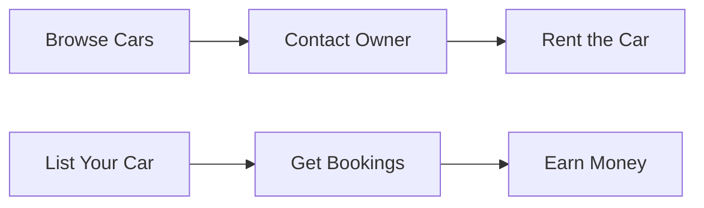

<div align="center">


# 🚗 CarsWift - Rent Your Dream Car

[](https://carswift2025.vercel.app/)
[](https://github.com/mca-programmer/Cars-Wift-Frontend)
[](LICENSE)

**Discover a seamless way to rent premium cars at the best prices**

[Live Demo](https://carswift2025.vercel.app/) • [Report Bug](https://github.com/mca-programmer/Cars-Wift-Frontend/issues) • [Request Feature](https://github.com/mca-programmer/Cars-Wift-Frontend/issues)

</div>

---

## 📋 Table of Contents

- [About The Project](#about-the-project)
- [Features](#features)
- [Tech Stack](#tech-stack)
- [Getting Started](#getting-started)
- [Installation](#installation)
- [Usage](#usage)
- [Screenshots](#screenshots)
- [How It Works](#how-it-works)
- [Contributing](#contributing)
- [Contact](#contact)
- [License](#license)

---

## 🎯 About The Project

**CarsWift** is a modern car rental platform that connects car owners with people looking to rent vehicles. Whether you need a car for a weekend getaway, a business trip, or your daily commute, CarsWift makes it easy to find and rent the perfect vehicle.

### Why CarsWift?

- 🔍 **Wide Selection**: Browse through a diverse range of verified rental cars
- 💬 **Direct Communication**: Contact car owners directly for details and availability
- 🚀 **Easy Listing**: Car owners can list their vehicles and start earning
- 🔒 **Secure Platform**: Safe and secure payment processing
- 📱 **User-Friendly**: Intuitive interface for seamless user experience
- 🌍 **Location-Based**: Find cars available in your city

---

## ✨ Features

### For Renters
- Browse and search available cars in your area
- Filter cars by type, price, and availability
- View detailed car information and specifications
- Direct contact with car owners
- Secure booking and payment process
- User reviews and ratings

### For Car Owners
- List your car for rent easily
- Manage your car listings
- Set your own pricing and availability
- Track bookings and earnings
- Communicate with potential renters

### General Features
- 🔐 User authentication (Login/Register)
- 👤 User profile management
- 🚗 Comprehensive car catalog
- 📝 FAQ section for common queries
- 📞 24/7 customer support
- 📱 Responsive design for all devices

---

## 🛠️ Tech Stack

<div align="center">


</div>

### Frontend Technologies
- **Framework**: Next.js (React Framework)
- **Language**: JavaScript/TypeScript
- **Styling**: Tailwind CSS
- **Image Optimization**: Next.js Image Component
- **Deployment**: Vercel

---

## 🚀 Getting Started

Follow these instructions to get a copy of the project up and running on your local machine.

### Prerequisites

Make sure you have the following installed:
- Node.js (v16 or higher)
- npm or yarn package manager
- Git


6. **Open your browser**
   
   Navigate to [http://localhost:3000](http://localhost:3000) to see the application running.

---

## 💻 Usage

### For Renters

1. **Browse Cars**: Visit the "All Cars" page to explore available vehicles
2. **Select a Car**: Click on any car to view detailed information
3. **Contact Owner**: Use the contact feature to communicate with the car owner
4. **Book**: Finalize your booking and payment

### For Car Owners

1. **Register/Login**: Create an account or log in to your existing account
2. **Add Your Car**: Navigate to "Add For Rent" and fill in your car details
3. **Manage Listings**: Go to "My Cars" to manage your listings
4. **Respond to Inquiries**: Communicate with potential renters

---

## 📸 Screenshots

<div align="center">

### Home Page


</div>

---

## 🔄 How It Works



1. **Browse Cars**: Explore a wide range of verified rental cars near you
2. **Contact Owner**: Easily contact the car owner for details and availability
3. **Rent the Car**: Finalize your agreement and enjoy a hassle-free ride
4. **List Your Car**: Have a car? Upload details and start earning

---

## 🗂️ Project Structure

```
Cars-Wift-Frontend/
├── public/
│   ├── assets/
│   │   ├── Logo_new.png
│   │   ├── footer_logo.png
│   │   └── banner_car.jpg
│   └── ...
├── src/
│   ├── app/
│   │   ├── page.tsx
│   │   ├── all-cars/
│   │   ├── about-us/
│   │   ├── faq/
│   │   ├── login/
│   │   └── register/
│   ├── components/
│   ├── lib/
│   └── styles/
├── .gitignore
├── package.json
├── next.config.js
├── tailwind.config.js
└── README.md
```

---

## 🤝 Contributing

Contributions are what make the open-source community such an amazing place to learn, inspire, and create. Any contributions you make are **greatly appreciated**.

### How to Contribute

1. **Fork the Project**
2. **Create your Feature Branch**
   ```bash
   git checkout -b feature/AmazingFeature
   ```
3. **Commit your Changes**
   ```bash
   git commit -m 'Add some AmazingFeature'
   ```
4. **Push to the Branch**
   ```bash
   git push origin feature/AmazingFeature
   ```
5. **Open a Pull Request**

---

## 🐛 Known Issues

- None at the moment. Please report any issues you find!

---

## 📈 Future Enhancements

- [ ] Advanced search filters (brand, model, year, color)
- [ ] Real-time chat system between renters and owners
- [ ] Payment gateway integration
- [ ] Review and rating system
- [ ] Mobile application (iOS & Android)
- [ ] Calendar integration for availability
- [ ] Insurance options
- [ ] Multi-language support

---

## 📞 Contact

**Project Maintainer**: MCA Programmer

- 📧 Email: musarrafhosen52@gmail.com
- 📱 Phone: +880 1701378952
- 🌐 Website: [carswift2025.vercel.app](https://carswift2025.vercel.app/)
- 💻 GitHub: [@mca-programmer](https://github.com/mca-programmer)

**Project Link**: [https://github.com/mca-programmer/Cars-Wift-Frontend](https://github.com/mca-programmer/Cars-Wift-Frontend)

---

## 📄 License

Distributed under the MIT License. See `LICENSE` file for more information.

---

## 🙏 Acknowledgments

- [Next.js Documentation](https://nextjs.org/docs)
- [React Documentation](https://react.dev/)
- [Tailwind CSS](https://tailwindcss.com/)
- [Vercel](https://vercel.com/)
- All contributors and users of CarsWift

---

<div align="center">

### ⭐ Star this repository if you find it helpful!

**Made with ❤️ in Sylhet, Bangladesh**

[](https://github.com/mca-programmer)

</div>
